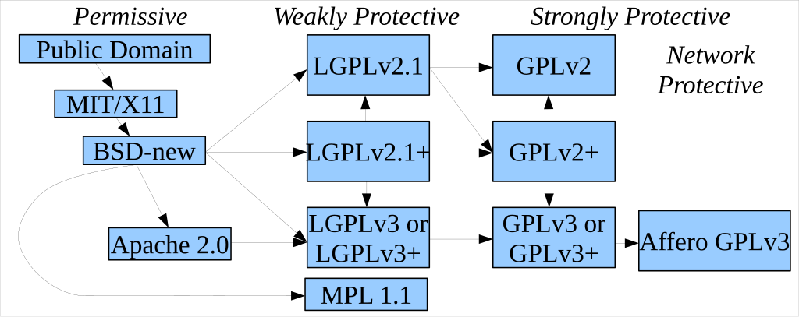

```{r libraries, include = FALSE}
library(xaringanthemer)
```

```{r xaringan-themer, include = FALSE}
style_mono_light(
  base_color = "#3092FF",
  header_font_google = google_font("Josefin Sans"),
  text_font_google   = google_font("Montserrat", "300", "300i"),
  code_font_google   = google_font("Droid Mono"),
)
```

# `DESCRIPTION`

- Every package must include a `DESCRIPTION` file (written using Debian control format (DCF)).

- Use `usethis::create_package("within")` to create a package.

```
Package: within
Title: What the Package Does (One Line, Title Case)
Version: 0.0.0.9000
Authors@R (parsed):
    * First Last <first.last@example.com> [aut, cre] (YOUR-ORCID-ID)
Description: What the package does (one paragraph).
License: `use_mit_license()`, `use_gpl3_license()` or friends to
    pick a license
Encoding: UTF-8
LazyData: true
Roxygen: list(markdown = TRUE)
RoxygenNote: 7.1.1
```

---

# `DESCRIPTION`

- Use `usethis::create_package("badpkg")` with [`usethis.*` options set](https://usethis.r-lib.org/articles/articles/usethis-setup.html#store-default-values-for-description-fields-and-other-preferences-1).

```
Title: R package for {{...}}.
Version: 0.0.0.9000
Authors@R: 
    person(given = "Mikhael",
           family = "Manurung",
           role = c("aut", "cre"),
           email = "me@gmail.com")
Description: An R package for {{...}}.
License: MIT + file LICENSE
```

global `.Rprofile`

```
usethis.description = list(
  Title = 'R package for {{...}}.',
  Description = 'An R package for {{...}}.',
  `Authors@R` = 'person("Mikhael", "Manurung", email = "me@gmail.com", 
    role = c("aut", "cre")
  )',
  License = 'MIT + file LICENSE',
  Version = '0.0.0.9000'
)
```

---

# `Title` and `Description`

- `Title`: Brief Package Description (One-Liner, Title Case).
- `Description`: A longer, more detailed description.

```
Package: within
Title: R Package with Simple Functions.
Description: An example R package.

```

>    *"There are only two hard things in Computer Science: cache invalidation and naming things.* -- Phil Karlton

---

# `Author@R`

- Should include name, email address, and role for each author.
- At least one author `aut` and one maintainer `cre`; they can be the same person.

```
Authors@R: c(
    person("Hadley", "Wickham", email = "hadley@rstudio.com", role = "cre"),
    person("Winston", "Chang", email = "winston@rstudio.com", role = "aut")
)
```

- Most common roles
  - `cre`: creator or maintainer
  - `aut`: authors, significant contributions
  - `ctb`: contributors, smaller contributions e.g. bug fix
  - `cph`: copyright holder (more on license)
- Use `comment` argument for further clarification
  
```{r echo=F, include=T, eval=T, out.width='60%', fig.align='center'}
knitr::include_graphics('img/tools-xkcd.png')
```

---

# `URL` and `BugReports`

- `URL` and `BugReports` list other resources available for help.
  - `BugReports` is often the issues page in the GitHub package repo.
  - Most commonly, `URL` points to the GitHub repo or a `{pkgdown}` site.

```{r echo=F, include=T, eval=T, out.width='40%', fig.align='center'}
knitr::include_graphics('img/fixing_problems-xkcd.png')
```

---

# `Version`

- Released packages: `<major>.<minor>.<patch>`
  - e.g. 1.2.3 = Major version 1, minor version 2, patch 3
- In-development packages: `0.0.0.9000`
- Use `usethis::use_version()` to increment version.

```{r echo=F, include=T, eval=T, out.width='50%', fig.align='center'}
knitr::include_graphics('img/software_updates-xkcd.png')
```

---

# Dependencies

- `Imports`
  - Lists packages that must be present for your package to work.
  - Packages will be installed if not already installed.
  - Packages will not be attached along with your package.
  - Best practice is to namespace functions (i.e. `package::function()` or `@importFrom pkg fun`).
- `Suggests`
  - Lists packages that are used, but not required (i.e. for tests, vignettes, or rarely used packages).
  - Packages will not be installed if not already installed.
  - Best practice is to use `requireNamespace()`.
  
- Use `usethis::use_package()` to add packages to `Imports` and `Suggests`.

---

# Dependencies

- Best practice is to specify a minimum rather than an exact version.

```
Depends: 
    R (>= 3.4.0)
Imports:
    ggplot2 (>= 3.0.0),
    dplyr (>= 1.0.0)
Suggests:
    testthat (>= 3.0.0)
```

- `LinkingTo`, `Enhances`, and `SystemRequirements` exist for specific reasons.
- Use `backports` if you want to use functions from newer R version so that you do not have to specify minimum R version.

---

# `License`

- Two major camps:
  - __Permissive__: Code can be freely copied, modified, and published as long as license is preserved.
  - __Copyleft__: Stricter.
- 3 recommended licenses for R devs:
  1. `MIT`. Very permissive.
  2. `GPL-2` or `GPL-3`. Anyone who modified your code must also make the source code open.
  3. `CC0`. Relinquish your rights. Anyone can use it for any purpose.
- More options on: https://choosealicense.com/licenses/
- Easy to create with `usethis::use_*_license()`
- Using a package or R != comply with the license.

---

# Copyright holder

- People who are allowed to choose or change the license.
- Who is the copyright holder?
  1. Writing code in your own time -> you
  2. Writing code for your employer -> your employer
  3. Writing code for contract work -> you unless stated otherwise
- Multiple authors = multiple copyright holders.
  - Each hold copyright for their specific contribution.

---

# Licenses

Licenses, from most to least permissive:

- `MIT`
  - Simple and permissive.
  - Others can freely use your code as long as they distribute the same license with their code.
  - Actually a "template" that points to another file, hence `MIT + file`
- `Apache`
  - Similar to the MIT license but it also includes an explicit patent grant.
- GNU Lesser General Public License (`LGPL`)
  - Mostly like `GPL`.
- GNU General Public License (`GPL-2` and `GPL-3`)
  - Stricter than `MIT`.
  - Those who use your code and distribute it must also make the source available.
  - `GPL-3` covers up for some "loopholes" in `GPL-2`.
- Affero General Public License (`AGPL`)
  - Defines "distribution" more strictly, such that it includes providing a service over a network.

---

# Licenses for data packages

Licenses for data packages, from most to least permissive:

- Creative Commons (`CC0`):
  - Most appropriate for data packages.
- `CC-BY`:
  - Like `CC0`, but author must be credited.

```{r echo=F, include=T, eval=T, out.width='50%', fig.align='center'}

```

---

# Other licensing things

- Re-licensing
  - Must check with all copyright holders
- Code given to you
  - Implicitly agreeing to your license.
  - Best practice is to acknowledge contributors somewhere.
- Common cases when bundling external code:
  1. Do nothing if (1) your license is same as external or if (2) external license is MIT or BSD.
  2. If external license is more restrictive, (1) make your license more restrictive, (2) find external code that uses a more permissive license, or (3) put the external code in a separate package.

```{r echo=F, include=T, eval=T, out.width='600', out.height='200', fig.align='center'}

```

---

#  Interesting licensing stories

- [Would `{arrow}` have been developed if `{dplyr}` had not been converted from GPLv2 to MIT?](https://twitter.com/wesmckinn/status/393122387610198016?s=20)

- [Tesla struggled to comply with GPL for Linux kernel.](https://sfconservancy.org/blog/2018/may/18/tesla-incomplete-ccs/)

- [The process of re-licensing `{ggplot2}`.](https://github.com/tidyverse/ggplot2/issues/4236)

